# Gym 健身搭子

<p align="center">
  一个面向 <strong>uni-app / 微信小程序 / H5</strong> 场景的健身社交项目，围绕
  <strong>找搭子 -> 组队 -> 协同训练 -> 打卡挑战 -> 实时消息 -> AI 辅助</strong>
  设计完整闭环。
</p>

<p align="center">
  它不只是“记录训练”的 CRUD 项目，而是试图解决一个更真实的问题：
  <strong>用户如何更容易开始训练，并且更长期地坚持下去。</strong>
</p>

<p align="center">
  
  
  
  
  
  
</p>

## 项目定位

`Gym` 是一个带有产品思考的全栈项目，目标不是单点功能演示，而是围绕健身习惯养成做一条完整链路：

- 用户先建立个人档案，明确训练目标、时间、场景、监督偏好
- 系统基于档案进行智能匹配，帮助用户找到更适合长期坚持的健身搭子
- 用户可以创建 2~3 人小组，固定训练时段，形成长期协作关系
- 训练过程中支持实时进度同步、组内聊天、挑战打卡与提醒
- 在训练内容之外，项目还提供地图找场馆、课程筛选、AI 健身顾问和动作分析

从面试视角看，这个项目比普通管理系统更有记忆点，因为它同时体现了：

- 业务建模能力：把“坚持训练”拆成匹配、协作、反馈、激励几个关键环节
- 全栈落地能力：前端页面、后端接口、缓存、消息、对象存储、AI 接入都覆盖到了
- 工程思考能力：不仅能做功能，还考虑了实时性、并发、一致性、兼容性和可扩展性

## 为什么这个项目值得面试官多看两分钟

### 1. 不是纯展示型项目，而是完整业务闭环

很多健身类项目只做到课程展示或训练记录，而这个项目把“开始训练”和“持续训练”都考虑进来了：

`建档 -> 匹配 -> 组队 -> 训练 -> 打卡 -> 消息协同 -> 数据复盘 -> AI 辅助`

### 2. 既有产品亮点，也有工程亮点

- 产品亮点：搭子关系、组内协作、挑战机制、训练坚持感
- 工程亮点：Redis 分桶匹配、实时消息、训练进度并发控制、RabbitMQ 异步提醒、AI 图文分析

### 3. 面试里可展开的话题足够多

- 智能匹配如何兼顾效果与性能
- 训练进度为什么先写 Redis、再落库 MySQL
- H5 与小程序实时通信为什么采用双通道方案
- AI 顾问为什么要做“统一对话 + 图片分析”而不是单一问答
- 这个项目相比传统管理后台，难点到底多在哪里

## 业务闭环

```text
登录 / 注册
   ->
完善健身档案
   ->
智能匹配合适搭子
   ->
创建或加入健身小组
   ->
开始协同训练并同步进度
   ->
参与挑战 / 每日打卡 / 接收提醒
   ->
组内聊天、复盘训练表现
   ->
AI 获取训练计划、饮食建议、动作分析
   ->
地图查找附近健身房与场馆
```

这个闭环的核心价值在于：把“一个人容易放弃”的训练过程，变成“有协作对象、有提醒、有反馈”的持续行为。

## 技术亮点

| 维度 | 设计方案 | 面试可以展开的点 |
| --- | --- | --- |
| 认证与鉴权 | `Spring Security + JWT`，HTTP 与 WebSocket 分别处理鉴权 | JWT 过滤器、握手拦截器、消息拦截器的职责划分 |
| 智能匹配 | `Redis 分桶 + 权重打分 + 结果缓存` | 如何减少全量扫描、如何设置目标/时间/场景权重 |
| 协同训练 | `Redis Hash + WATCH/MULTI/EXEC + MySQL 落库` | 并发下只接受更大进度、保证训练进度不回退 |
| 实时通信 | H5 使用 `WebSocket + STOMP`，小程序侧保留原生 WS / HTTP 兼容方案 | 多端通信协议差异与兼容策略 |
| 挑战提醒 | `@Scheduled + RabbitMQ + WebSocket` | 为什么提醒消息要走异步链路而不是直接同步发送 |
| 数据缓存 | Redis 缓存统计结果、组列表、课程详情、匹配结果 | 缓存命中、过期策略、Redis 不可用时如何降级 |
| 文件与资源 | `MinIO / OSS` 管理头像、课程图、动作分析图片 | 训练图片、头像和课程封面如何做统一存储 |
| AI 能力 | `LangChain4j + DashScope/Qwen` 实现文本问答、图文问答、动作分析 | 为什么要构建统一上下文、如何把用户档案注入提示词 |

## 适合面试重点讲的 6 个点

1. 这个项目不是“堆功能”，而是围绕用户坚持训练这件事做产品设计。
2. 匹配模块不是简单 SQL 查询，而是用了 Redis 分桶降低候选集规模，再做权重打分。
3. 协同训练不是普通表单提交，而是涉及实时进度同步、并发控制和最终一致性。
4. 消息系统考虑了多端兼容，H5 用 STOMP，小程序环境做原生适配与降级处理。
5. AI 功能不是简单接一个聊天接口，而是把用户档案、训练目标和图像分析结合进统一能力。
6. 项目里既有用户可见的产品价值，也有后端工程上的复杂度，适合作为全栈项目展示。

## 效果图总览

下面已经引用了 `screenshots/` 目录中的全部效果图，便于直接用于 GitHub / Gitee 项目展示。

### 1. 登录、首页与基础用户形态

<table>
  <tr>
    <td align="center">
      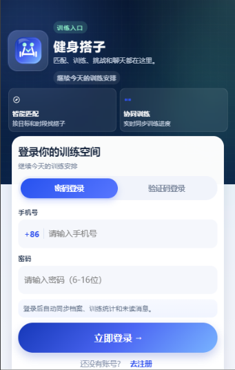
    </td>
    <td align="center">
      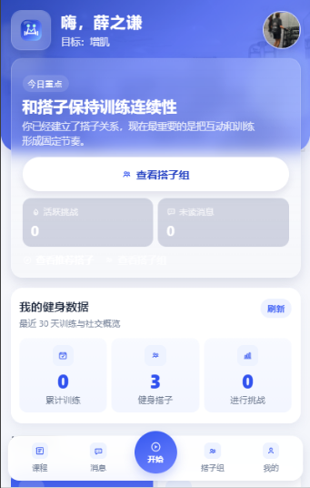
    </td>
    <td align="center">
      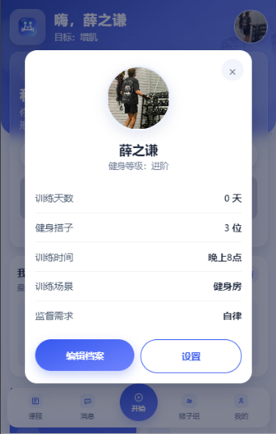
    </td>
  </tr>
  <tr>
    <td align="center"><strong>登录页</strong><br />支持密码登录与验证码登录入口</td>
    <td align="center"><strong>首页总览</strong><br />聚合搭子组、训练数据与快捷入口</td>
    <td align="center"><strong>档案概览</strong><br />展示目标、时间、场景和监督偏好</td>
  </tr>
</table>

### 2. 档案配置、课程筛选与训练启动

<table>
  <tr>
    <td align="center">
      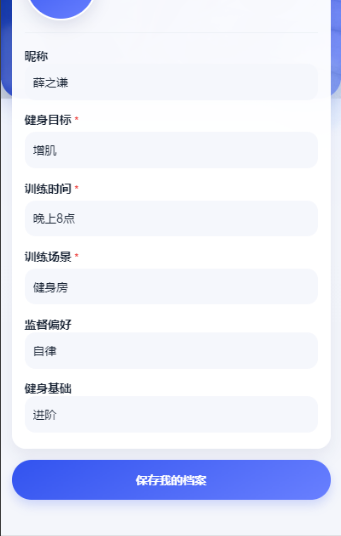
    </td>
    <td align="center">
      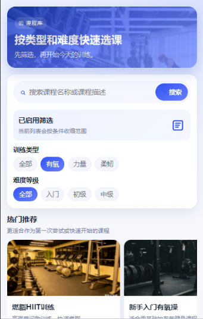
    </td>
    <td align="center">
      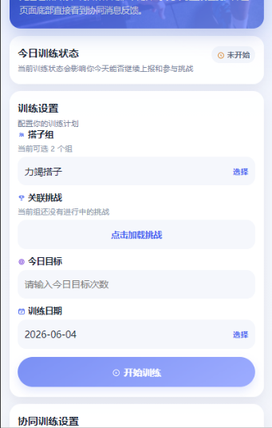
    </td>
  </tr>
  <tr>
    <td align="center"><strong>档案编辑</strong><br />补齐训练目标、时间、场景、基础与监督偏好</td>
    <td align="center"><strong>课程中心</strong><br />按训练类型和难度快速筛选课程</td>
    <td align="center"><strong>协同训练</strong><br />绑定搭子组、挑战和当日训练目标</td>
  </tr>
</table>

### 3. 智能匹配、组队与邀请流程

<table>
  <tr>
    <td align="center">
      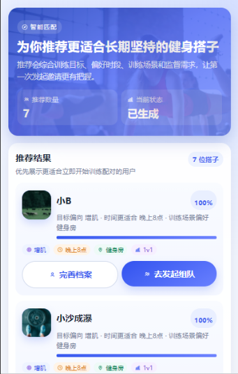
    </td>
    <td align="center">
      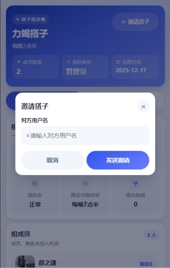
    </td>
    <td align="center">
      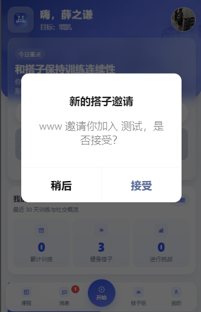
    </td>
  </tr>
  <tr>
    <td align="center"><strong>智能匹配</strong><br />按目标、时间和场景推荐更适合坚持的搭子</td>
    <td align="center"><strong>发起邀请</strong><br />通过用户名邀请用户加入搭子组</td>
    <td align="center"><strong>邀请接收</strong><br />被邀请用户可在首页直接接受或稍后处理</td>
  </tr>
</table>

### 4. 搭子组详情与组内聊天

<table>
  <tr>
    <td align="center">
      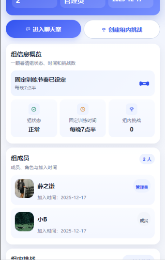
    </td>
    <td align="center">
      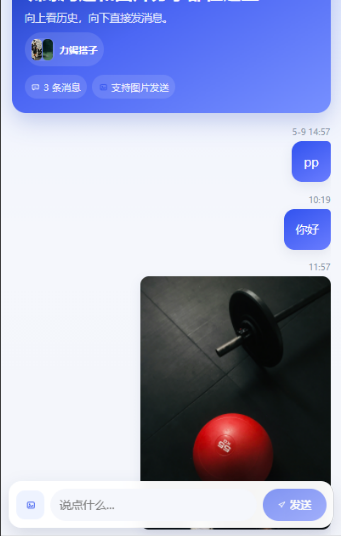
    </td>
  </tr>
  <tr>
    <td align="center"><strong>搭子组详情</strong><br />查看固定训练时间、成员信息、状态与挑战入口</td>
    <td align="center"><strong>实时聊天</strong><br />支持图片消息与训练协作沟通</td>
  </tr>
</table>

### 5. 地图找场馆与导航

<table>
  <tr>
    <td align="center">
      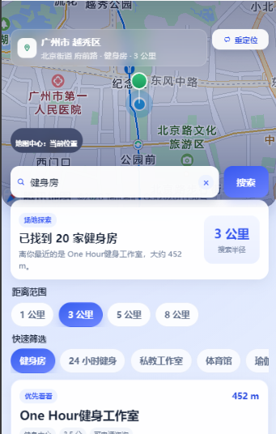
    </td>
    <td align="center">
      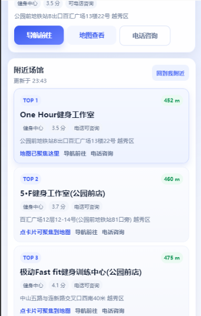
    </td>
    <td align="center">
      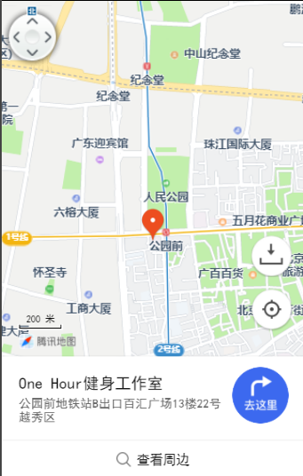
    </td>
  </tr>
  <tr>
    <td align="center"><strong>地图搜索</strong><br />根据当前位置查找附近健身房与场馆</td>
    <td align="center"><strong>场馆列表</strong><br />展示距离、评分、电话咨询和地图联动</td>
    <td align="center"><strong>导航能力</strong><br />支持查看位置与跳转导航</td>
  </tr>
</table>

### 6. AI 健身顾问与动作分析

<table>
  <tr>
    <td align="center">
      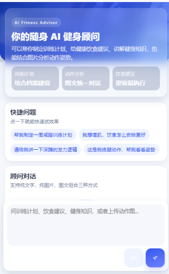
    </td>
    <td align="center">
      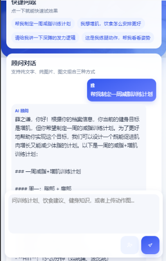
    </td>
    <td align="center">
      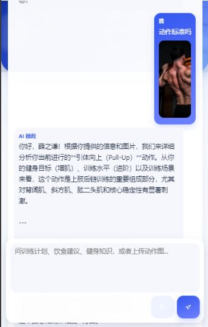
    </td>
  </tr>
  <tr>
    <td align="center"><strong>AI 顾问入口</strong><br />提供训练计划、饮食建议与健身知识问答</td>
    <td align="center"><strong>图文问答</strong><br />结合用户档案返回更贴合目标的建议</td>
    <td align="center"><strong>动作分析</strong><br />上传动作图片后进行姿势与发力分析</td>
  </tr>
</table>

## 核心功能清单

### 1. 用户认证与档案管理

- 支持注册、密码登录、验证码登录
- 使用 JWT 完成无状态认证
- 档案字段覆盖健身目标、训练时间、训练场景、监督偏好、基础水平

### 2. 智能匹配

- 基于目标、时间、场景、监督需求、健身水平做多维匹配
- 使用 Redis 分桶减少候选规模
- 对匹配结果进行缓存，避免重复计算

### 3. 搭子组管理

- 支持创建 2~3 人训练小组
- 支持通过用户名发起邀请
- 展示组成员、固定训练时段、状态与挑战入口

### 4. 协同训练

- 开始训练、上报进度、查看今日训练记录
- 训练进度实时同步到组内成员
- 训练完成后可自动联动挑战打卡

### 5. 挑战与打卡

- 支持公开挑战和组内挑战
- 支持每日打卡、进度追踪和提醒
- 使用定时任务与 RabbitMQ 分发提醒消息

### 6. 实时消息

- 支持组内聊天、图片消息、未读消息统计
- H5 使用 WebSocket + STOMP
- 小程序场景保留原生 WebSocket / HTTP 兼容方案

### 7. 课程与统计

- 课程中心支持按类型、难度和关键词筛选
- 首页与统计页展示训练数据、搭子数量、挑战参与情况
- Redis 缓存统计结果，提升查询速度

### 8. 地图与 AI 扩展能力

- 地图页支持附近健身房搜索、半径筛选、电话咨询与导航
- AI 页支持文本问答、图文问答、动作图片分析

## 技术架构

```text
uni-app / H5 / 微信小程序
          |
     HTTP / WebSocket
          |
Spring Boot 3.2.5
  |       |       |       |       |
MySQL   Redis  RabbitMQ  MinIO   AI(Qwen)
```

### 前端

- `uni-app`
- `Vue 3`
- `SCSS`
- `uni.request` 封装请求
- `WebSocket + STOMP`（H5）

### 后端

- `Java 17`
- `Spring Boot 3.2.5`
- `Spring Security`
- `MyBatis-Plus`
- `MySQL`
- `Redis`
- `RabbitMQ`
- `MinIO`
- `Spring WebSocket`
- `SpringDoc OpenAPI`
- `LangChain4j`

## 关键设计说明

### 1. 匹配算法

项目没有把“找搭子”做成简单的条件筛选，而是做了两层策略：

- 第一层：按 `健身目标 + 训练时间 + 训练场景` 做 Redis 分桶
- 第二层：在候选人集合中按权重打分

当前权重设计大致为：

- 健身目标 `30%`
- 训练时间 `25%`
- 训练场景 `20%`
- 监督需求 `15%`
- 健身水平 `10%`

这样做的好处是：

- 避免全量扫描所有用户
- 推荐结果更接近“适合长期一起练”的人，而不是简单相似用户

### 2. 协同训练实时进度

训练进度的设计重点不是“能不能保存”，而是“多人同时上报时如何保持合理结果”。

- Redis Key 采用 `train:progress:{groupId}:{date}`
- 使用 `Hash` 存储组内每个成员当日进度
- 使用 `WATCH/MULTI/EXEC` 保证并发下只接受更大的进度值
- 成功后再同步落库 MySQL，并通过 WebSocket 通知组内成员

这让它更像一个实时协作场景，而不是普通表单更新。

### 3. 邀请与提醒链路

- 组邀请先写入 Redis，设置 24 小时过期
- 接收方可在首页即时感知邀请
- 挑战提醒通过定时任务扫描后发到 RabbitMQ，再由消费者分发通知

这种设计把“主流程处理”和“通知类处理”解耦了，便于后续扩展站内信、短信或 Push。

### 4. AI 统一能力

AI 模块并不是只提供一个聊天框，而是拆成了三类场景：

- 文本问答：训练计划、饮食建议、健身知识
- 图文问答：带上下文的统一对话
- 动作分析：上传图片后分析姿势和发力问题

后端通过 `LangChain4j + Qwen` 统一模型调用，并结合用户档案构建提示上下文。

## 页面与后端模块对应关系

| 业务模块 | 前端页面 | 后端能力 |
| --- | --- | --- |
| 认证 | `pages/auth/login.vue` `pages/auth/register.vue` | `AuthController` / JWT / 验证码 |
| 首页 | `pages/index/index.vue` | `StatController` / 组邀请与统计聚合 |
| 个人档案 | `pages/user/profile.vue` `pages/user/setting.vue` | `UserController` |
| 智能匹配 | `pages/match/index.vue` | `MatchController` / `MatchServiceImpl` |
| 搭子组 | `pages/group/*` | `GroupController` / `GroupServiceImpl` |
| 协同训练 | `pages/training/*` | `TrainingController` / `TrainingServiceImpl` |
| 挑战系统 | `pages/challenge/*` | `ChallengeController` / `ChallengeServiceImpl` |
| 实时聊天 | `pages/group/chat.vue` | `ChatController` / `WebSocketServiceImpl` |
| 课程中心 | `pages/course/*` | `CourseController` / `CourseServiceImpl` |
| 数据统计 | `pages/stat/index.vue` | `StatController` / `StatServiceImpl` |
| 地图能力 | `pages/map/index.vue` | 地图 Web API |
| AI 顾问 | `pages/ai/advisor.vue` | `AiController` / `AiUnifiedChatServiceImpl` |

## 项目结构

```text
Gym
├─ src/main/java/com/gym
│  ├─ ai/                 # AI 顾问、图文问答、动作分析
│  ├─ common/             # 通用响应、异常、错误码
│  ├─ config/             # 安全、WebSocket、Redis、Swagger、MinIO 等配置
│  ├─ controller/         # 认证、用户、匹配、组队、训练、挑战、课程、统计、聊天
│  ├─ consumer/           # RabbitMQ 消费者
│  ├─ dto/                # 数据传输对象
│  ├─ entity/             # 实体类
│  ├─ job/                # 定时任务
│  ├─ mapper/             # MyBatis Mapper
│  ├─ service/            # 业务服务
│  └─ util/               # JWT 等工具类
├─ src/main/resources
│  ├─ application.yml
│  ├─ application-local.yml
│  └─ system-prompt.txt
├─ Gym_fronted
│  ├─ common/             # API、HTTP、认证、WebSocket、配置
│  ├─ pages/              # 业务页面
│  ├─ static/             # 图标、背景、脚本资源
│  ├─ App.vue
│  ├─ main.js
│  └─ pages.json
├─ screenshots/           # README 展示效果图
├─ PROJECT_OVERVIEW.md    # 项目概览
├─ CODE_DOCUMENTATION.md  # 代码讲解文档
└─ README.md
```

## 快速开始

### 环境要求

- `JDK 17+`
- `Maven 3.9+`
- `MySQL 8+`
- `Redis 6+`
- `RabbitMQ 3.8+`
- `MinIO`
- `Node.js 16+`
- `HBuilderX` 或 `uni-app CLI`

### 1. 启动后端

根据本地环境修改：

- `src/main/resources/application.yml`
- `src/main/resources/application-local.yml`

重点确认：

- MySQL 连接
- Redis 连接
- RabbitMQ 连接
- MinIO / OSS 配置
- JWT 密钥
- AI 模型 API Key

启动命令：

```bash
mvn spring-boot:run
```

或：

```bash
mvn clean package
java -jar target/gym-0.0.1-SNAPSHOT.jar
```

默认地址：

- API: `http://localhost:8080`
- Swagger: `http://localhost:8080/swagger-ui.html`
- 备用 Swagger 地址: `http://localhost:8080/swagger-ui/index.html`

### 2. 启动前端

修改：

- `Gym_fronted/common/config.js`

把后端地址改成你的本机地址或局域网 IP。

在 `Gym_fronted` 目录下执行：

```bash
npm install
npm run dev:h5
```

也可以直接使用 `HBuilderX` 打开 `Gym_fronted` 目录，运行到：

- H5 浏览器
- 微信开发者工具
- 真机调试

## 运行说明

### 地图能力

地图页面位于：

- `Gym_fronted/pages/map/index.vue`

需要配置地图相关 Key 后才能正常使用周边搜索、定位和导航能力。

### 实时通信

- H5 端使用 STOMP WebSocket，连接入口为 `/ws`
- 小程序侧项目保留了原生 WebSocket / HTTP 兼容处理思路
- 适合在面试中说明“同一业务在多端协议下如何兼容”

### AI 顾问

- 前端页面：`Gym_fronted/pages/ai/advisor.vue`
- 后端入口：`src/main/java/com/gym/ai/controller/AiController.java`
- 支持文本问答、统一图文对话、动作图片分析

## 当前仓库说明

为了保证 README 真实可信，这里也说明一下当前仓库现状：

- 已具备较完整的前后端业务代码与页面效果
- 已包含项目概览文档与代码讲解文档
- 当前仓库中暂未看到数据库初始化 SQL 脚本，落地时需要自行补充建表脚本或从本地环境导出
- 本地配置中的敏感信息建议改为环境变量，不要直接随仓库提交

## 如果继续迭代，我会优先补的内容

1. `Docker Compose` 一键启动 MySQL / Redis / RabbitMQ / MinIO
2. 数据库初始化 SQL 与演示种子数据
3. 核心模块单元测试与接口测试
4. 更完整的消息通知中心与 Push 策略
5. 匹配结果解释性展示，让用户知道“为什么推荐这个搭子”

## 文档索引

- [项目概览](./PROJECT_OVERVIEW.md)
- [代码讲解文档](./CODE_DOCUMENTATION.md)

## License

当前仓库更适合作为学习、课程设计、作品集展示和面试项目使用。如需商用，请自行补充授权、合规和安全治理方案。
