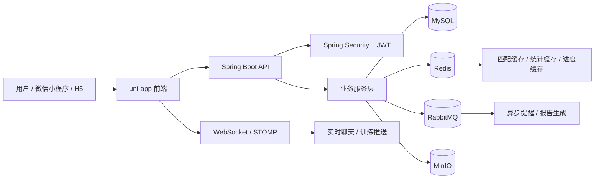
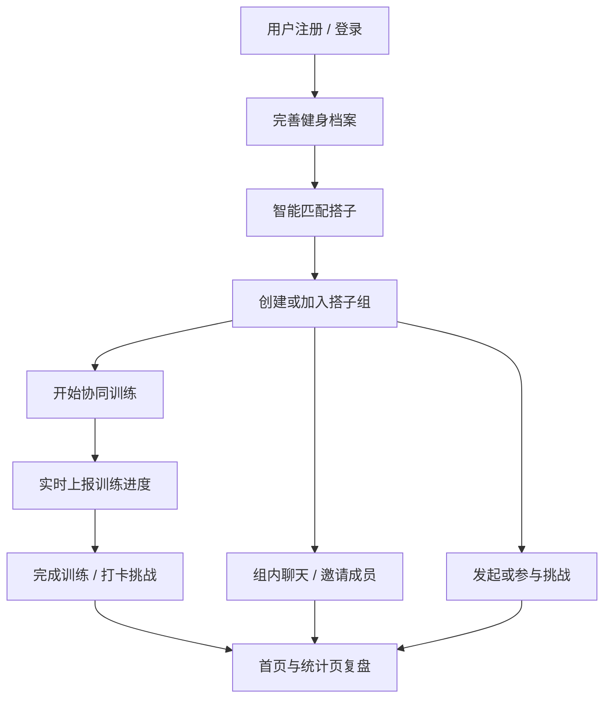

# Motes - 健身搭子智能匹配与协同训练系统

聚焦“找搭子难、监督弱、易放弃”的健身痛点，围绕「智能匹配 + 搭子组协作 + 协同训练 + 挑战打卡 + 实时聊天」构建一套完整的健身社交闭环。

## 项目亮点

- 智能匹配：根据健身目标、训练时间、训练场景、监督需求和基础水平做多维匹配。
- 搭子组协作：支持创建小组、邀请成员、查看组内协作安排与挑战节奏。
- 协同训练：训练过程支持实时上报进度，形成更强的陪伴感和监督感。
- 挑战打卡：支持公开挑战和组内挑战，把训练坚持做成可追踪的节奏。
- 实时消息：组内聊天、邀约通知、未读消息聚合到统一消息中心。
- 数据看板：从个人训练、组内协作、挑战进度多个维度做复盘。

## 项目效果

### 1. 登录、首页与邀请
<p align="center">
  
  
  
</p>

### 2. 搭子组、消息与聊天
<p align="center">
  
  
  
</p>

### 3. 协同训练、匹配与课程
<p align="center">
  
  
  
</p>

### 4. 档案与组管理
<p align="center">
  
  
</p>

## 核心功能

### 用户认证
- 手机号 + 密码登录
- 手机号 + 验证码登录
- JWT Token 认证
- Spring Security 权限控制

### 用户档案
- 健身目标、训练时间、训练场景、监督需求等档案管理
- 档案信息缓存
- 档案更新后自动影响匹配结果

### 搭子匹配
- 多维度匹配算法
- Redis 分桶粗筛优化
- 匹配结果缓存
- 支持 1v1 和多人组队

### 搭子组与消息
- 创建搭子组
- 发送 / 接受 / 拒绝邀约
- 组详情、成员管理、组内挑战
- 消息中心与组内聊天

### 协同训练
- 开始训练 / 放弃训练 / 上报进度
- 训练进度实时同步
- Redis + 定时任务做状态同步

### 挑战系统
- 创建公开挑战 / 组内挑战
- 参与挑战、打卡、防重处理
- 挑战报告与状态跟踪

### 数据统计
- 个人训练统计
- 组内协作统计
- 挑战完成度统计
- 首页概览数据

### 课程系统
- 推荐课程、课程筛选、课程详情
- 支持不同类型和难度等级

## 技术栈

### 前端
- `uni-app`
- `Vue`
- `SCSS`
- `WebSocket / 轮询`

### 后端
- `Spring Boot 3.2.5`
- `Spring Security`
- `JWT`
- `MyBatis-Plus`
- `MySQL 8`
- `Redis`
- `RabbitMQ`
- `WebSocket + STOMP`
- `MinIO`
- `Swagger / OpenAPI`

## 系统架构图



## 业务流程图



## 项目结构

```text
Gym/
├── src/main/java/com/gym/          # 后端代码
├── src/main/resources/             # 配置与资源
├── Gym_fronted/                    # 前端 uni-app 项目
│   ├── pages/                      # 页面
│   ├── common/                     # API / auth / ws / config
│   ├── static/                     # 图标、背景等静态资源
│   └── components/                 # 公共组件
├── docs/                           # 数据库脚本与说明文档
├── screenshots/                    # 项目截图
├── PROJECT_OVERVIEW.md             # 项目总览
└── CODE_DOCUMENTATION.md           # 代码注释说明
```

## 快速开始

### 环境要求
- JDK 17+
- Maven 3.6+
- MySQL 8+
- Redis 6+
- RabbitMQ 3.8+
- MinIO（可选）

### 1. 初始化数据库

```bash
mysql -u root -p gym < docs/gym.sql
```

### 2. 修改后端配置

编辑 `src/main/resources/application.yml`，配置：
- MySQL
- Redis
- RabbitMQ
- MinIO

### 3. 启动后端

```bash
mvn spring-boot:run
```

或

```bash
mvn clean package
java -jar target/gym-0.0.1-SNAPSHOT.jar
```

### 4. 启动前端

编辑 `Gym_fronted/common/config.js` 中的后端地址，然后：
- 使用 `HBuilderX` 打开 `Gym_fronted`
- 运行到微信开发者工具或 H5

### 5. 查看接口文档

```text
http://localhost:8080/swagger-ui/index.html
```

## 典型页面

- 首页：`Gym_fronted/pages/index/index.vue`
- 智能匹配：`Gym_fronted/pages/match/index.vue`
- 搭子组：`Gym_fronted/pages/group/index.vue`
- 消息中心：`Gym_fronted/pages/group/messages.vue`
- 组内聊天：`Gym_fronted/pages/group/chat.vue`
- 协同训练：`Gym_fronted/pages/training/index.vue`
- 挑战系统：`Gym_fronted/pages/challenge/index.vue`
- 课程系统：`Gym_fronted/pages/course/index.vue`

## 相关文档

- [项目总览](PROJECT_OVERVIEW.md)
- [代码注释说明](CODE_DOCUMENTATION.md)
- [数据库初始化脚本](docs/gym.sql)
- [数据库配置说明](docs/DATABASE_SETUP.md)
- [聊天功能说明](docs/CHAT_FEATURE.md)

## 许可证

MIT
